>

# SentinelView: Custom Wazuh SIEM Dashboard & Agent Integration 🛡️

SentinelView is a custom-built Security Information and Event Management (SIEM) dashboard powered by React, Vite, and the Wazuh API. This project demonstrates the complete end-to-end deployment of a Wazuh Manager on AWS, the integration of Windows and Linux endpoints, and the execution and detection of MITRE ATT&CK techniques.

## 🏗️ Architecture Overview

The project is split into three main components:
1. **The Server Layer:** An AWS EC2 Instance running the Wazuh Central Manager and Wazuh Indexer.
2. **The Endpoints Layer:** Virtual machines (Ubuntu & Windows 11) running the Wazuh Agent to collect system logs and Sysmon events.
3. **The Presentation Layer:** **SentinelView**, a custom local React dashboard that securely proxies into the Wazuh API to visualize threats in real-time.

---

## 🚀 Phase 1: Server Deployment (AWS EC2)

The Wazuh Manager was deployed on a dedicated AWS EC2 `t3.medium` instance. 

1. **Provisioning:** An Elastic IP (`XX.XX.XX.XX`) was attached to ensure a static routing address for the agents.
2. **Installation:** We utilized the Wazuh Quickstart deployment script to spin up the Wazuh Indexer, Manager, and Dashboard.
   ```bash
   curl -sO https://packages.wazuh.com/4.7/wazuh-install.sh && sudo bash ./wazuh-install.sh -a
   ```
3. **API Access:** Passwords for the API (`wazuh-wui`) and Indexer (`admin`) were securely extracted from `wazuh-passwords.txt` and integrated into the SentinelView `.env.local` configuration.

---

## 💻 Phase 2: Building SentinelView (Custom GUI)

To provide a sleek, modern, and focused view of our security posture, we built a custom frontend.

- **Tech Stack:** React, TypeScript, Vite, Tailwind CSS, TanStack Query.
- **Features:** 
  - Real-time Agent Monitoring (Active/Disconnected states, OS mapping).
  - Live Alert Feed with Severity mapping.
  - Interactive MITRE ATT&CK coverage matrix.
  - AI Assistant for log summarization.

*(SentinelView GUI Showcase:)*
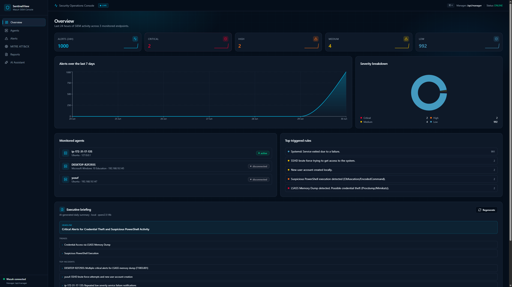
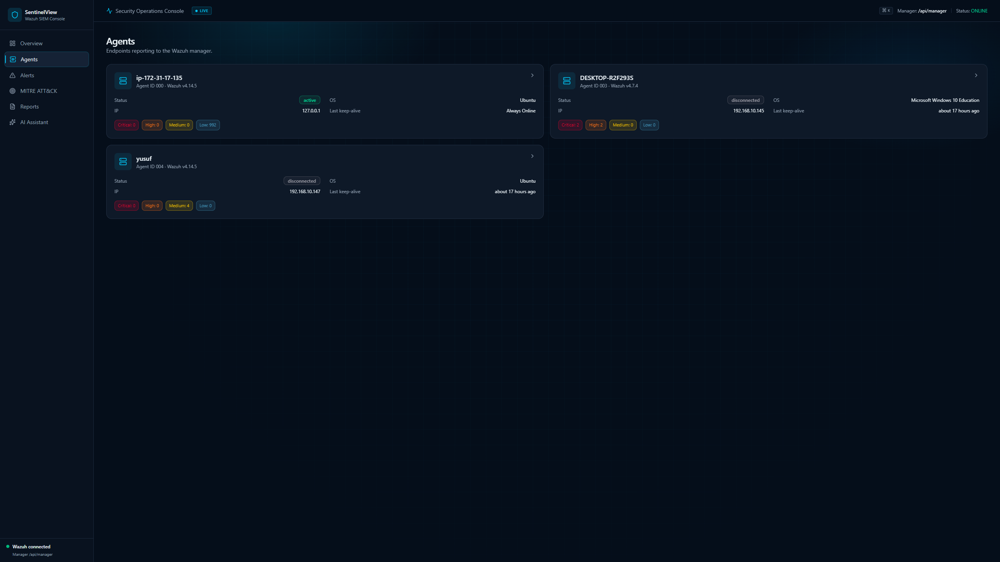
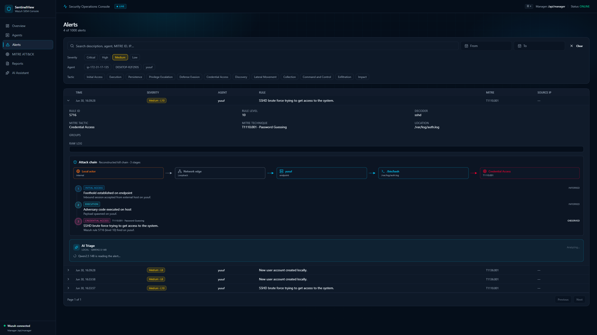
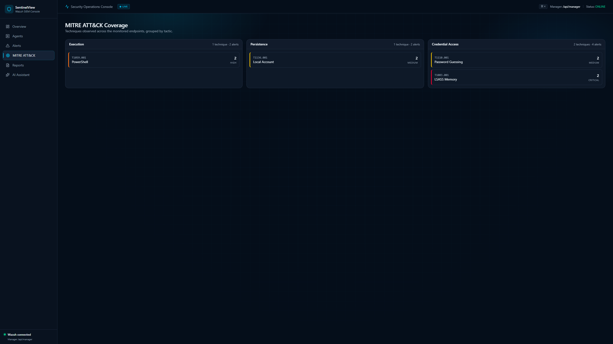
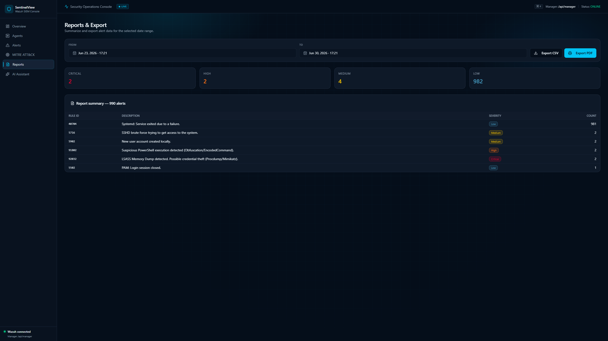
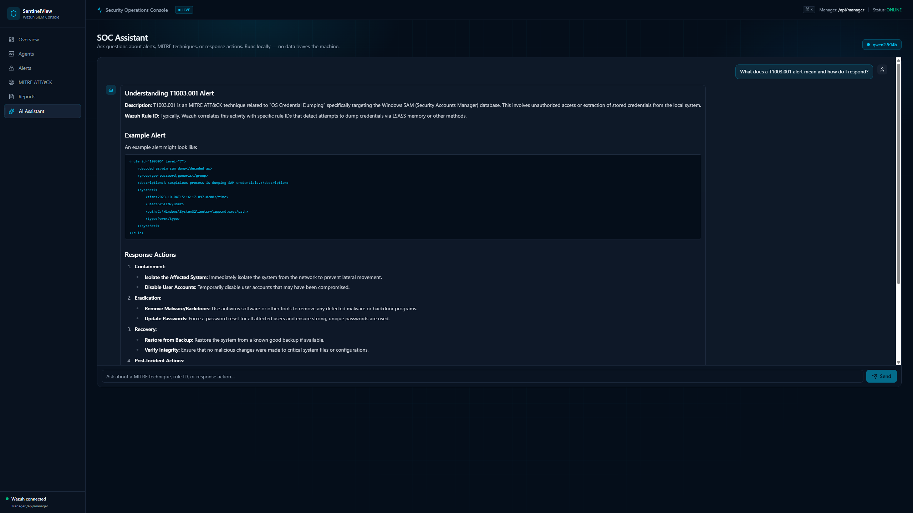
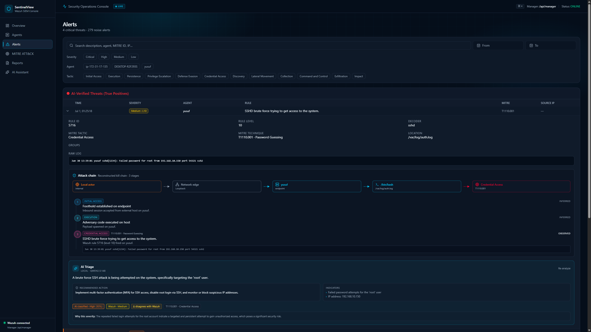
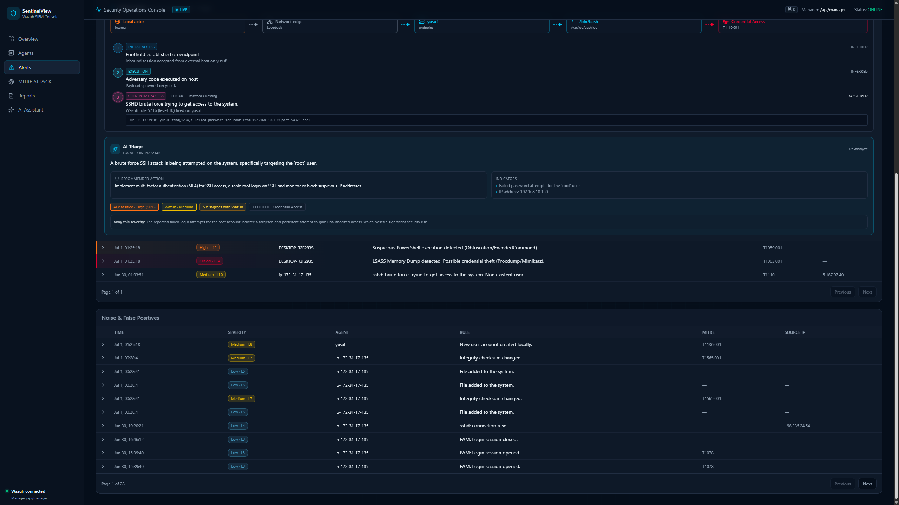

---

## 🔗 Phase 3: Agent Deployment & Configuration

### 🐧 1. Linux Endpoint (Ubuntu)
- Installed the Wazuh Agent via APT.
- Configured `/var/ossec/etc/ossec.conf` to point to the AWS Elastic IP (`XX.XX.XX.XX`).

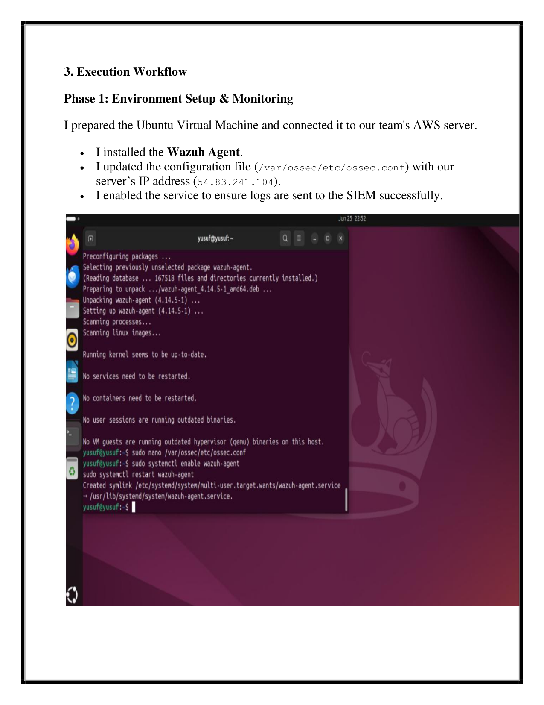

### 🪟 2. Windows Endpoint (Windows 11)
- Installed the Wazuh Agent via MSI silently.
- Deployed Sysmon with SwiftOnSecurity's configuration for deep telemetry.

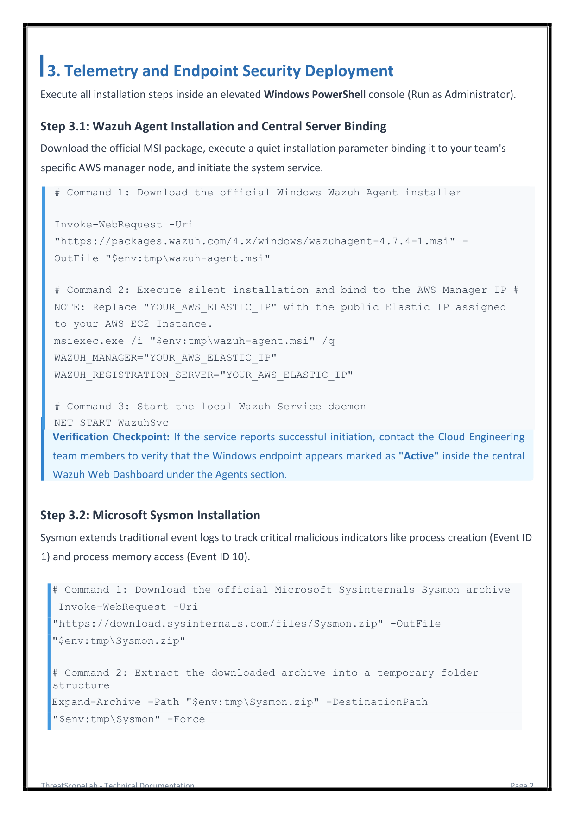
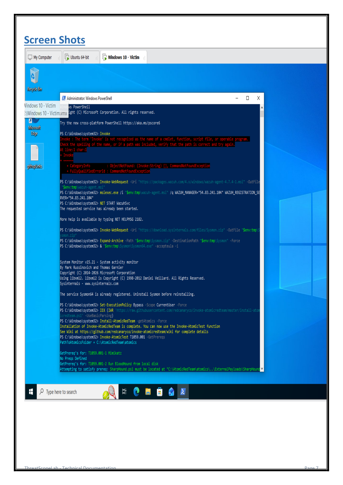

---

## ⚔️ Phase 4: Threat Simulation (MITRE ATT&CK)

### Attack 1 & 2: PowerShell & LSASS (Windows)
- Simulated `T1059.001` & `T1003.001` using **Atomic Red Team**.

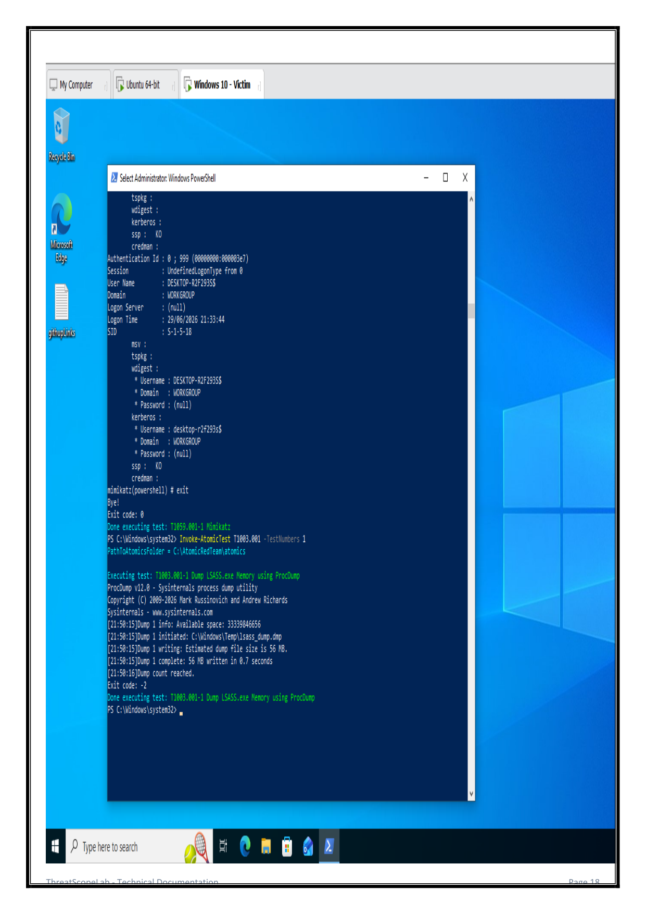

### Attack 3 & 4: SSH Brute Force & Persistence (Linux)
- Simulated `T1110.001` using `hydra` and `T1136.001` via `useradd`.

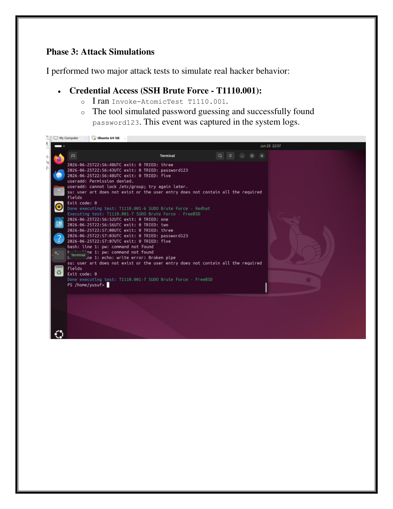

---

## 👥 Team Roles & Responsibilities

This project was a collaborative effort, with the architecture securely partitioned into specialized roles:

### 1. Cloud Engineers (Hazem & Abdelrahman)
- Create AWS Account & Launch EC2 (Ubuntu).
- Install Wazuh Stack & Configure Wazuh Manager.
- Assign Static IP (Elastic IP) & Open Required Ports.
- Ensure Manager is Online & Verify Agents Connection.
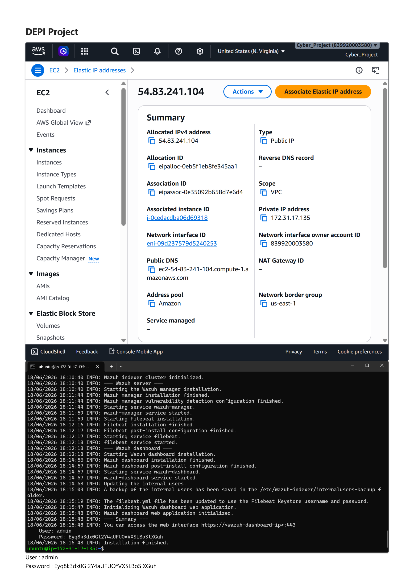

### 2. Linux Victim (Youssef)
- Create Ubuntu VM & Install Wazuh Agent.
- Connect to Manager (via Static IP).
- Install Atomic Red Team (Linux).
- Run MITRE ATT&CK Tests.
- Verify Sysmon/auditd Logs & Ensure Logs are Sent.
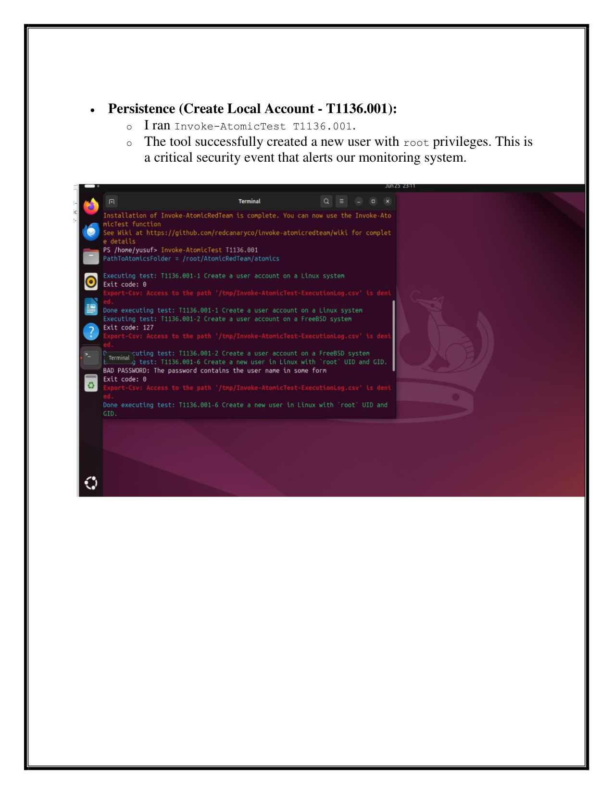

### 3. Windows Victim (Alsafy)
- Create Windows 11 VM & Install Wazuh Agent.
- Connect to Manager (via Static IP).
- Install Sysmon & Atomic Red Team (Windows).
- Run MITRE ATT&CK Tests & Ensure Logs are Sent.
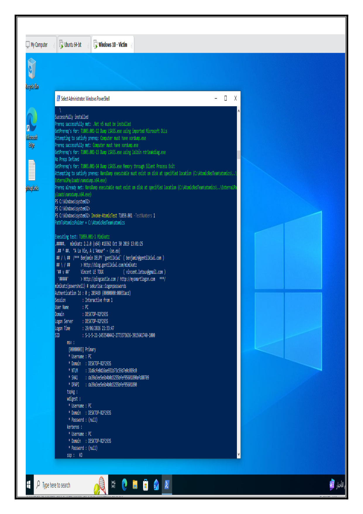

### 4. Rules Engineer (Anas)
- SSH to Wazuh Manager.
- Analyze Logs & Events & Create Custom Rules.
- Map to MITRE ATT&CK & Test Rules with New Events.
- Fine-tune & Optimize & Ensure Alerts are Generated.

### 5. GUI Developers (Adham & Anas)
- Build React Dashboard (Local).
- Connect to Wazuh API & Fetch Alerts & Agents Data.
- Show Charts & Statistics, Filters, Search, Timeline & Export Reports (PDF/CSV).

### 6. Collaboration (All Team)
- Regular Meetings & Share Findings.
- Document Everything & Prepare Final Report.
- Final Presentation & Demo.

---

## 🏁 Conclusion

This project successfully demonstrates a full-circle security operation: from infrastructure deployment and log ingestion to custom data visualization and live threat detection. SentinelView acts as the perfect lightweight lens into the power of the Wazuh engine.
